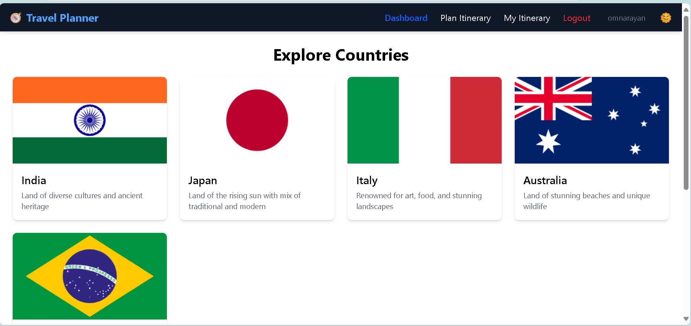
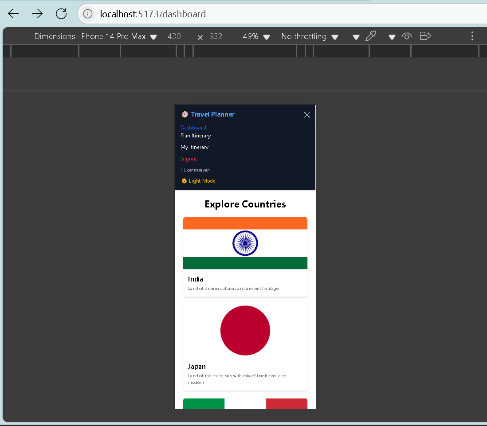
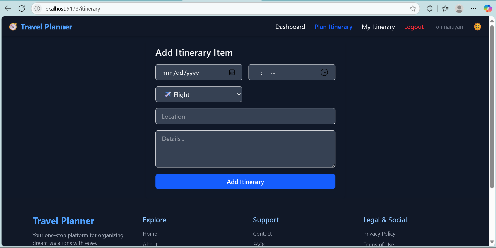
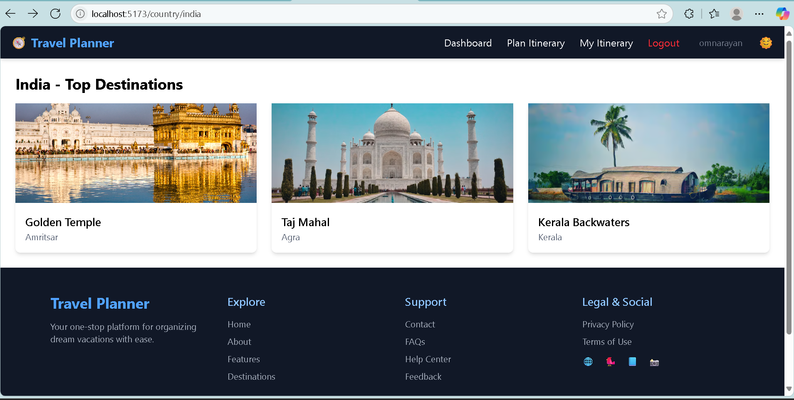
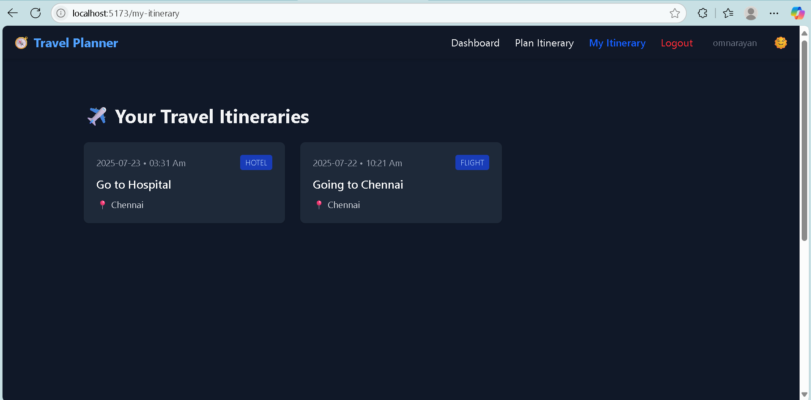
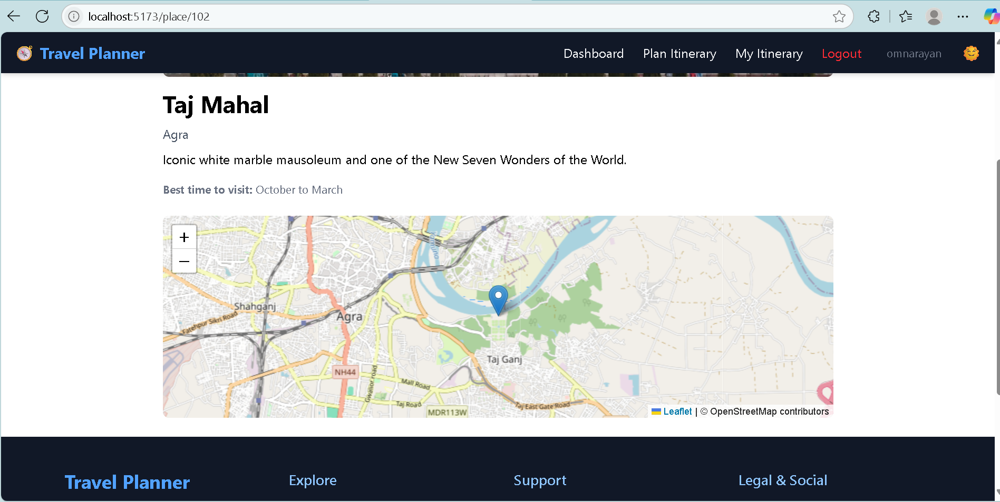

---
## 🧭 Travel Itinerary Planner

A web-based application that allows users to explore countries, view top destinations, plan personalized itineraries, and manage their travel plans. Built using **React**, **Tailwind CSS**, **Firebase Authentication**, and **React Router**.
---

### 🚀 Features

- 🔐 **User Authentication** (Login / Signup using Firebase)
- 🌍 **Explore Countries** with flag, description, and destination cards
- 📍 **Place Details** with image, best time to visit, and transportation info
- 📌 **Itinerary Planning** with saved routes (coming soon)
- 🧭 **Interactive Map Support** (Leaflet map for places)
- 🌓 **Dark/Light Theme Toggle**
- 📱 **Responsive UI** for mobile and desktop
- 🔒 **Protected Routes** (Dashboard & Itinerary only accessible after login)

---

### 📁 Folder Structure

```
src/
├── assets/               # Static assets(images,) logos)
├── components/           # Navbar, MapView, etc.
├── context/              # AuthContext &
ThemeContext
├── data/                 # travelData.js (countries & destinations)
├── pages/                # All main pages (Login, Dashboard, PlaceDetails, etc.)
├── App.jsx               # Routes + Navigation
└── main.jsx              # App entry point
```

---

### 🛠️ Tech Stack

- **React**
- **React Router DOM**
- **Tailwind CSS**
- **Firebase (Authentication)**
- **Leaflet (Map Display)**
- **Vite (Build Tool)**

---

### 🔧 Setup Instructions

#### 1. Clone the repository

```bash
git clone https://github.com/yourusername/travel-itinerary-planner.git
cd travel-itinerary-planner
```

#### 2. Install dependencies

```bash
npm install
```

#### 3. Firebase Setup

- Go to [Firebase Console](https://console.firebase.google.com/)
- Create a project
- Enable **Email/Password Authentication**
- Get your config credentials and replace them in `src/firebase.js`:

```js
// Example firebase.js
import { initializeApp } from "firebase/app";
import { getAuth } from "firebase/auth";

const firebaseConfig = {
  apiKey: "YOUR_API_KEY",
  authDomain: "your-project.firebaseapp.com",
  projectId: "your-project-id",
  // ...
};

const app = initializeApp(firebaseConfig);
export const auth = getAuth(app);
```

#### 4. Start the development server

```bash
npm run dev
```

Visit `http://localhost:5173`

---

### 🛡️ Route Access Logic

| Page             | Requires Login |
| ---------------- | -------------- |
| `/login`         | ❌             |
| `/signup`        | ❌             |
| `/dashboard`     | ✅             |
| `/itinerary`     | ✅             |
| `/my-itinerary`  | ✅             |
| `/place/:id`     | ✅             |
| `/country/:name` | ✅             |

---

### 📸 Screenshots

| Dashboard View                            | Place Details                                 | Mobile Navbar                                 |
| ----------------------------------------- | --------------------------------------------- | --------------------------------------------- |
|  |  |  |

   
   |
  |
  |
    |


---

### ✨ To-Do

- [ ] Allow users to create and save itineraries
- [ ] Add Google Maps API for better directions
- [ ] Multi-language support
- [ ] Admin dashboard for destination updates

---

### 🙌 Contributors
  #### Solo Project 
     Rajesh Kumar Gupta

---
